# NBASalaryValuation
# Bang for Your Buck: Analysis of NBA Salaries 2021
Programmer: Tristan Smith

## Purpose
Athletes in the NBA receive multi-million dollar contracts on a yearly basis. However, like in many sports, sometimes these contracts result in a lack of production and a loss of money. Other times, certain teams must make do with a limited cap due to past transgressions and current contracts. From these two situations, a valuable tool for NBA teams would be an analysis and predictive model evaluating player contracts and potential player contracts. This program has developed through Python to fill this need and it will explore current and past player contracts, assess factors that relate to these payments, and then build a machine learning models that will assign a contract value to each player's performance.

## Resources
#### Packages

* Pandas
* Numpy
* CSV
* Matplotlib
* Sci-kit Learn

#### Sources

* NBAStats.net (www.nbastats.net)
* Hoops Hype (www.hoopshype.com)
* Chris Davis NBA Salaries (https://data.world/datadavis/nba-salaries)

## Exploratory Graphs and Distributions
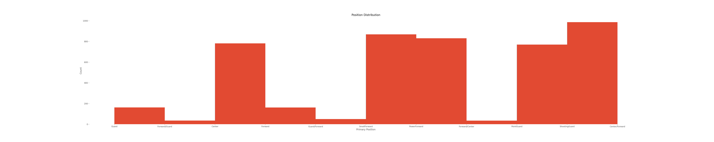
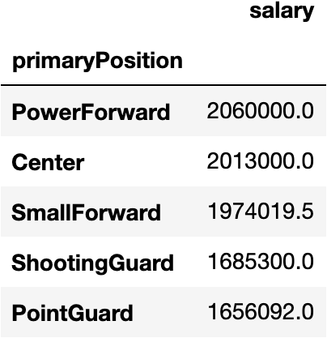
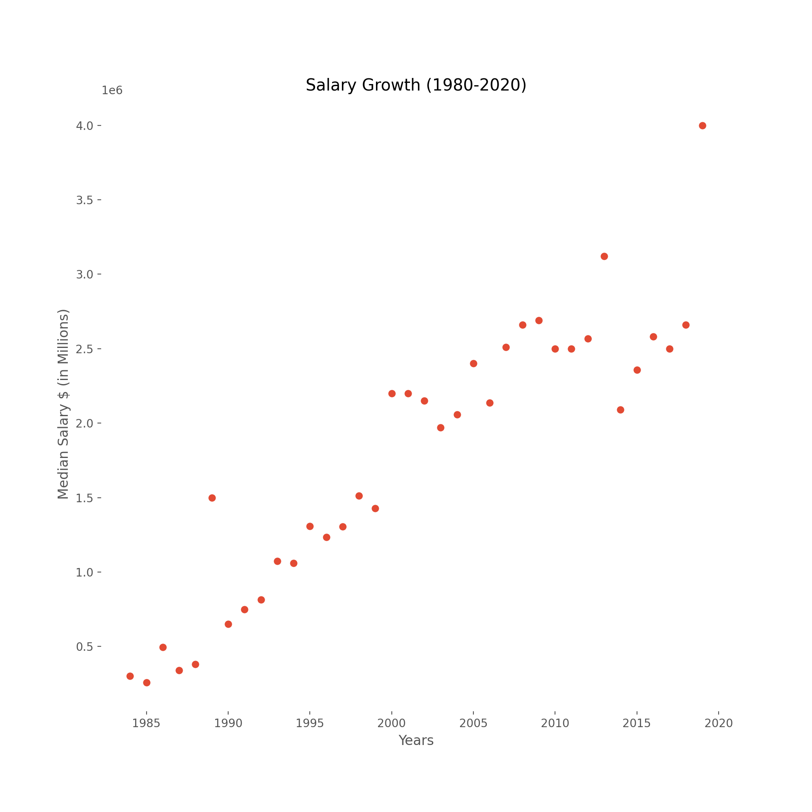

## Model
### Correlations
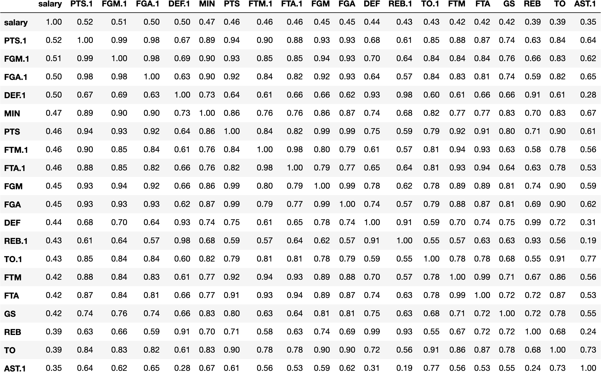

### Results
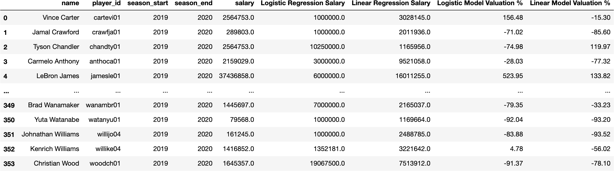

## Optimization Questions
### Question 1 - Which players have a fair-value contract?
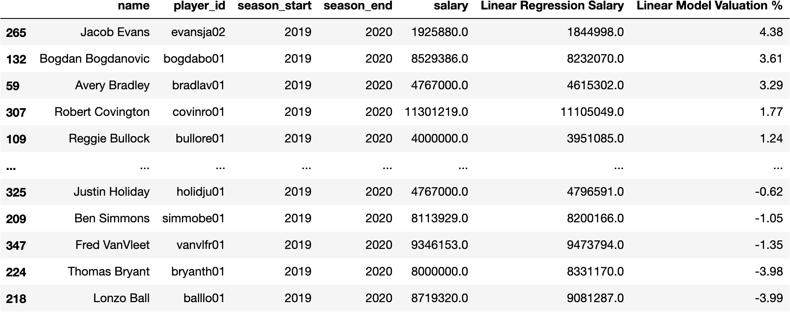
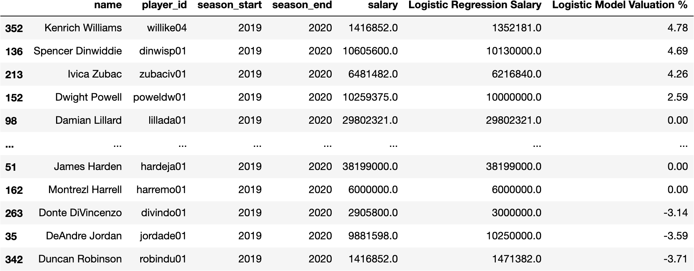

## Question 2 - Which players are overpaid?
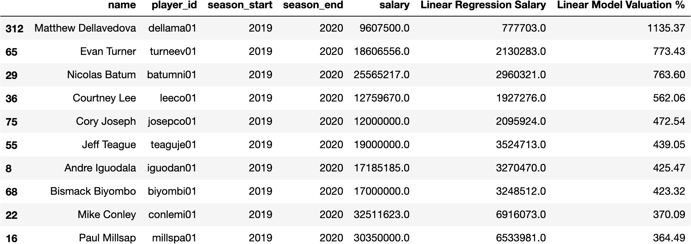
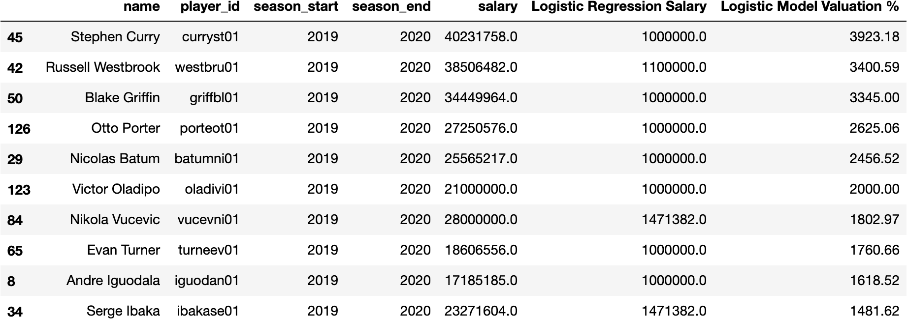

### Question 3 - Which players are undervalued? What are they worth?
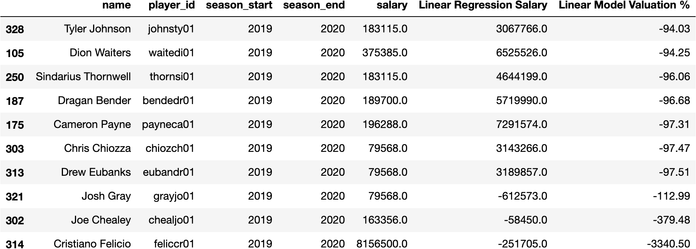
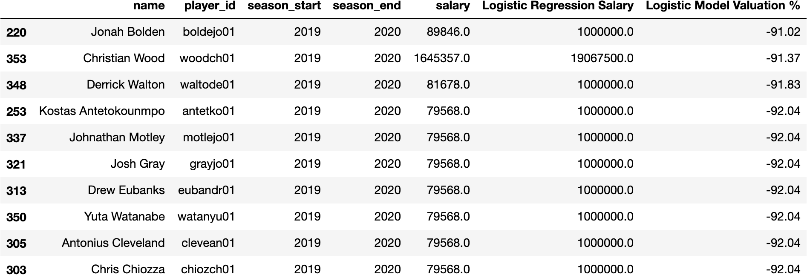

